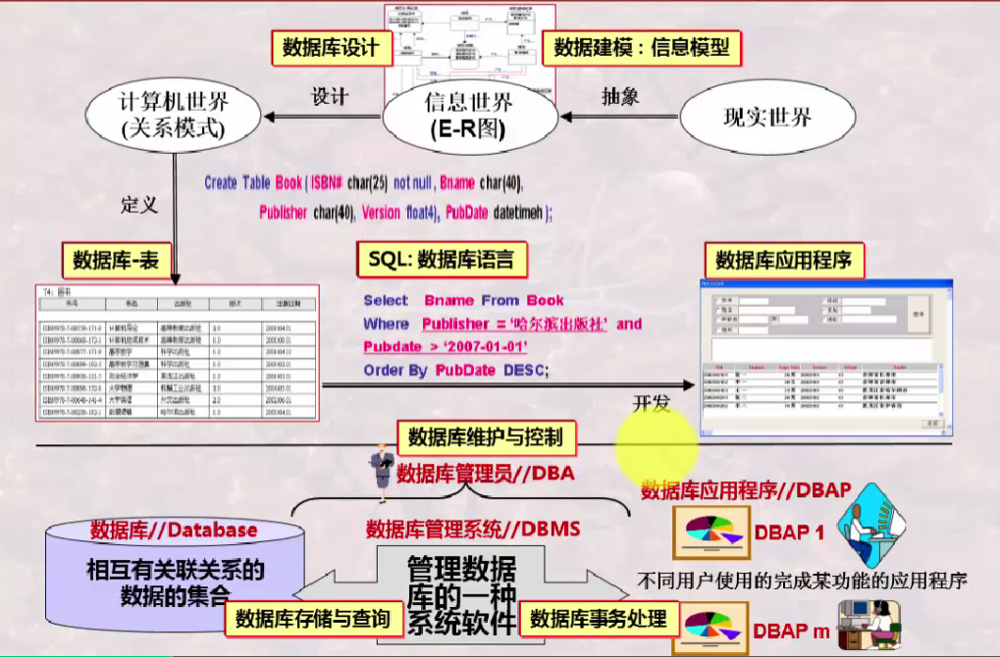
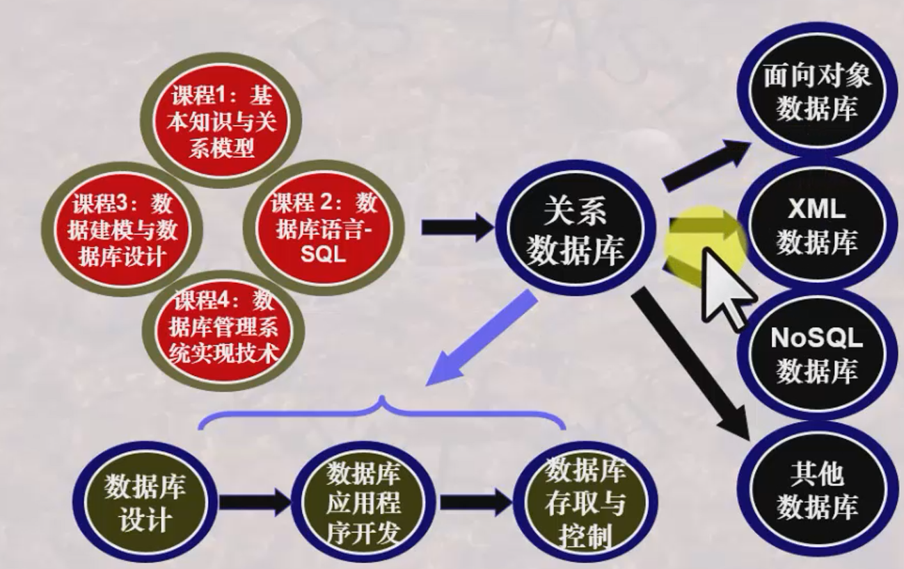
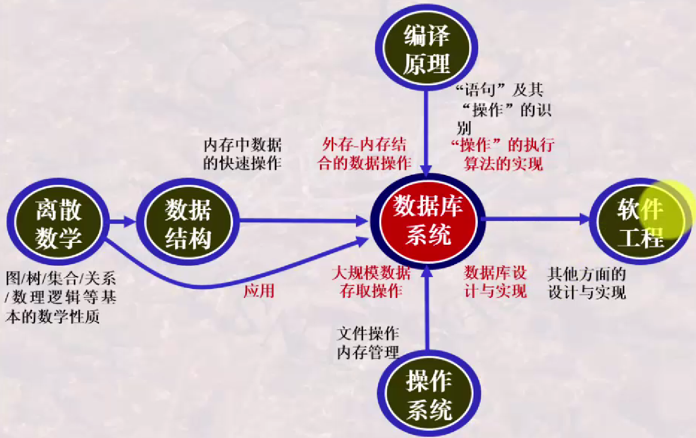

# 数据库系统

*数据库系统课程的地位：*

---

*数据库系统课程的主要内容：*

数据库相关对象：

- 数据库：表的集合
- 数据库管理系统
- 数据库应用程序

数据库与现实世界：

- 现实世界→信息世界：抽象/建模
- 信息世界→计算机世界：设计

数据库相关任务：

- 数据库维护
- 数据库存储与查询
- 数据库事务处理

课程划分：

---

*数据库系统课程与其他学科的关系：*

---

*课程学习方法：*

## 模型与语言

[模型与语言](模型与语言/README.md)

## 建模与设计

[建模与设计](建模与设计/README.md)

## 管理与技术

[管理与技术](管理与技术/README.md)