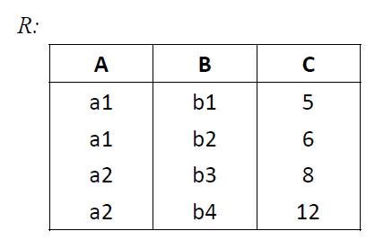
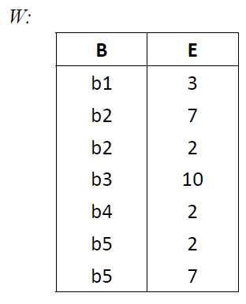

# 《数据库系统》课程第一次作业-关系运算

>   学号：200110503
>
>   姓名：孙铎

一．设有如图所示的关系R，W 和D，计算并画出查询结果：

1）$R_1=R\underset{C<E}\bowtie W$

$R_1$：

| R.A  | R.B  | R.C  | W.B  | W.E  |
| :--: | :--: | :--: | :--: | :--: |
|  a1  |  b1  |  5   |  b2  |  7   |
|  a1  |  b1  |  5   |  b3  |  10  |
|  a1  |  b1  |  5   |  b5  |  7   |
|  a1  |  b2  |  6   |  b2  |  7   |
|  a1  |  b2  |  6   |  b3  |  10  |
|  a1  |  b2  |  6   |  b5  |  7   |
|  a2  |  b3  |  8   |  b3  |  10  |

2）$R_2=\pi_{[2],[1],[5]}(\sigma_{[2]=[4]}(R\times W))$

$R_2$：

| B    | A    | E    |
| ---- | ---- | ---- |
| b1   | a1   | 3    |
| b2   | a1   | 7    |
| b2   | a1   | 2    |
| b3   | a2   | 10   |
| b4   | a2   | 2    |

3）$R_3=R\bowtie W$

$R_3$：

| A    | B    | C    | E    |
| ---- | ---- | ---- | ---- |
| a1   | b1   | 5    | 3    |
| a1   | b2   | 6    | 7    |
| a1   | b2   | 6    | 2    |
| a2   | b3   | 8    | 10   |
| a2   | b4   | 12   | 2    |

4）$R_4=W\div D$

$R_4$：

|  B   |
| :--: |
|  b2  |
|  b5  |

5）$R_5=\pi_{W.B}(\sigma_{W.E='2'\wedge W1.E='7'}(W\underset{W.B=W1.B}\bowtie\rho_{W1}W))$

| W.B  |
| :--: |
|  b2  |
|  b5  |

---

二．设某著名学校办有若干分校，其学校数据库中有三个关系。用关系代数完成下列检索：

`TE(T#, TNAME, AGE, SEX, TCITY)`
即教职工关系（教职工编号，姓名，年龄，性别，籍贯）

`W(T#, U#, SALARY, DEPART)`
即工作关系（教职工编号，工作的分校编号，工资，院系）

`UN(U#, UNAME, UCITY, PRI_U#)`
即学校关系（分校编号，分校名称，分校所在城市，分校校长编号）

1）检索工资高于 7000 的男教职工的编号，姓名和工作的分校编号；

$\Pi_{T\#,TNAME,U\#}(\sigma_{SALARY>7000\wedge SEX='男'}(TE\bowtie W))$

2）检索在“深圳”工作的女教职工的编号，姓名和工资；

$\Pi_{T\#,TNAME,SALARY}(\sigma_{UCITY='深圳'\wedge SEX='女'}(TE\bowtie W\bowtie UN))$

3）检索至少在两个分校工作的教职工编号；

$\Pi_{W.T\#}(\sigma_{W.U\#\ne W1.U\#}( W\underset{W.T\#=W1.T\#}\bowtie\rho_{W1}(W)))$

4）检索在名称为‘A 校’和‘B 校’兼职的教职工编号，姓名和院系；

$\Pi_{T\#,TNAME,DEPART}(\sigma_{UNAME='A~校'}(TE\bowtie W\bowtie UN))\cap \Pi_{T\#,TNAME,DEPART}(\sigma_{UNAME='B~校'}(TE\bowtie W\bowtie UN))$

5）检索各分校校长的编号、姓名和工资；

$\Pi_{PRI\_U\#,TNAME,SALARY}(UN\underset{PRI\_U\#=T\#}\bowtie W\bowtie TE)$

6）检索籍贯和分校所在城市相同的校长的编号和姓名；

$\Pi_{PRI\_U\#,TNAME}(\sigma_{UCITY=TCITY}(UN\underset{PRI\_U\#=T\#}\bowtie TE))$

7）检索籍贯和分校所在城市不同的教职工编号和姓名；

$\Pi_{T\#,TNAME}(\sigma_{TCITY\ne UCITY}(TE\bowtie W\bowtie UN))$

8）检索年龄大于其所在分校校长的教职工的编号和姓名；

$\Pi_{TE.T\#,TE.TNAME}(\sigma_{TE.AGE>TE1.AGE}(TE\bowtie W\bowtie UN\underset{PRI\_U\#=TE1.T\#}\bowtie \rho_{TE1}(TE)))$

9）检索不在‘A 校’工作的教职工编号和姓名；

$\Pi_{T\#,TNAME}(TE)-\Pi_{T\#,TNAME}(\sigma_{UCITY='A~校'}(TE\bowtie W\bowtie UN))$

10）编号为‘T233’的教职工在多个分校兼职，检索在 T233 职工兼职的所有分校都兼职工作的教职工姓名。

$\Pi_{TNAME,U\#}(TE\bowtie W)\div\Pi_{U\#}(\sigma_{T\#='T233'}(W))$

