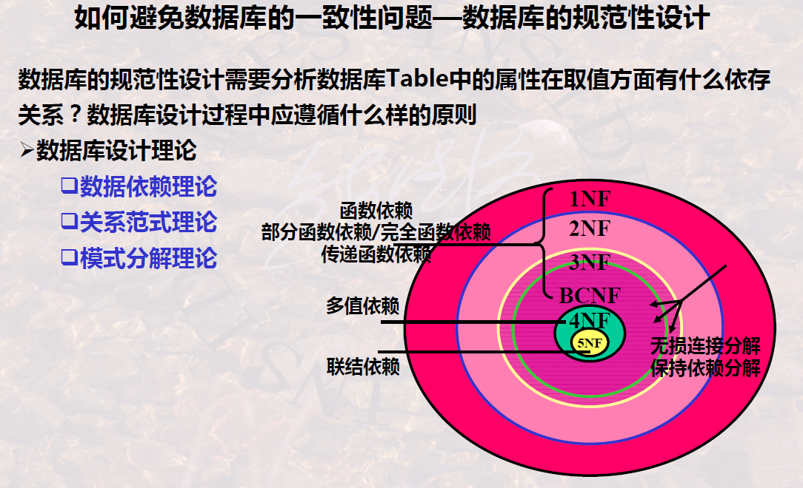
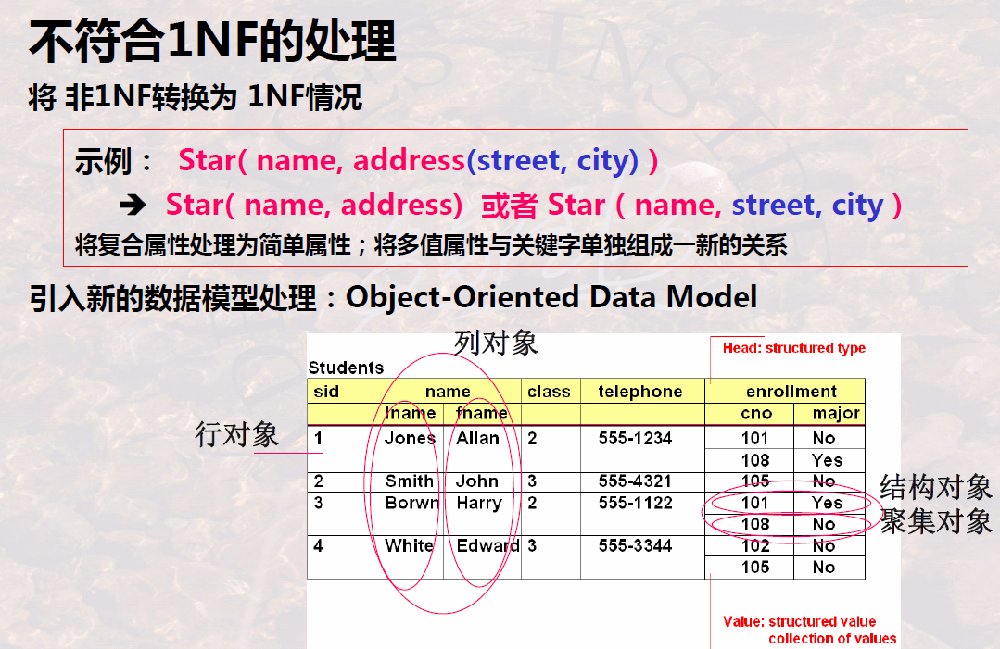

# Normal Form of Relation Schema Design

## First Normal Form

-   No **composite attribute**
-   No **multi-valued attribute**

>   Example:
>
>   

---

Handle situation where 1NF is violated:

## Second Normal Form

-   ***Partial Function Dependency***, but notice that it is alternative attribute and candidate key
-   Uncontrolled redundancy: attributes related with **partial dependency** causes the **other attributes** being redundant
-   Schema decomposition

>   Examples:
>
>   

## Third Normal Form

### 1 Definition

-   ***Transitive function dependency*** is nonexistent, but notice X is candidate key, A is alternative attribute

    >   Refer to the definition of transitive function dependency

-   Uncontrolled redundancy: the **transitivity** itself is **redundant**. Since the deduction is certain,  there is no need to add the **deduced attributes** in the schema

>   Examples:
>
>   
>
>   -   **Argumentation rule** is required in the demonstration
>
>   

### 2 Relation Schema Decomposition

1.   **Decompose** into schemas composed by single function dependency
2.   **Combine** some schemas, ensuring 3NF

## Boyce-Codd Normal Form

### 1 Definition

-   All function dependencies’ left parts contain a candidate key

>   Examples:
>
>   
>
>   -   Notice the **definition** of transitive function dependency, this situation doesn’t satisfy **all the conditions**
>
>   

### 2 Relation Schema Decomposition

## Multi-valued Dependency

### 1 Definition

-   For those tuples which have the same X, their Y can be randomly exchanged, the result tuples also belong to the same relationship

### 2 Properties

>   Example:
>
>   

### 3 Axioms and Theorems

-   Transitivity in multi-valued dependency is more strict

-   A7 and A8 indicate the relation between function dependency and multi-valued dependency

>   Examples of demonstration
>
>   
>
>   
>
>   -   Notice that $X\cap Z\subseteq Z,X\cap Z\subseteq X$
>   -   Notice that w[Y]=s[Y] and w[U-Z-Y]=s[U-Z-Y], so w[U-Z]=s[U-Z]
>
>   

## Forth Normal Form

-   The conditions aim to eliminate **non-trivial function dependency**
-   By contrast with **BCNF**, here it is **multi-valued dependency**

---

## Brief Summary

