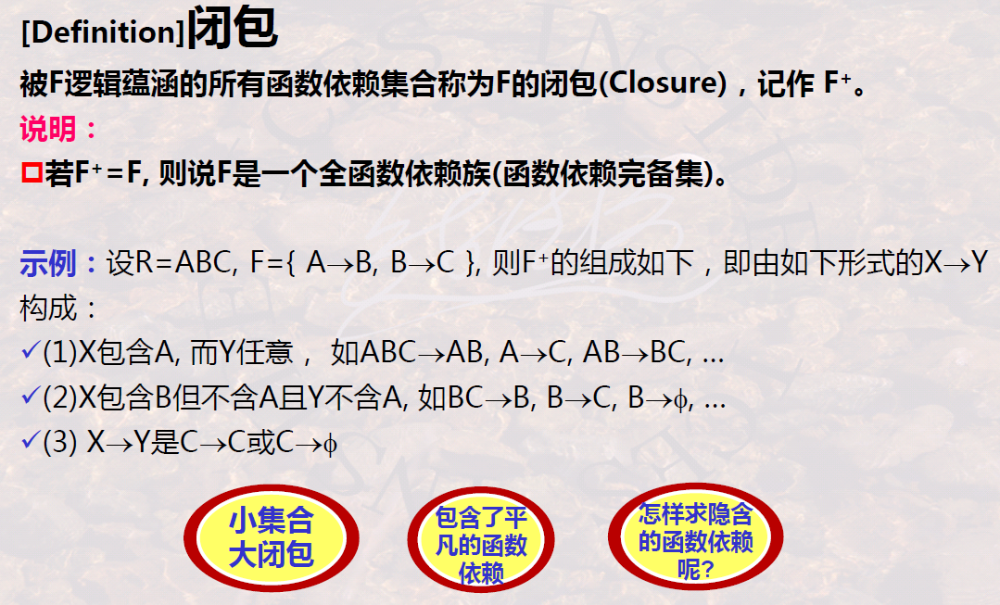
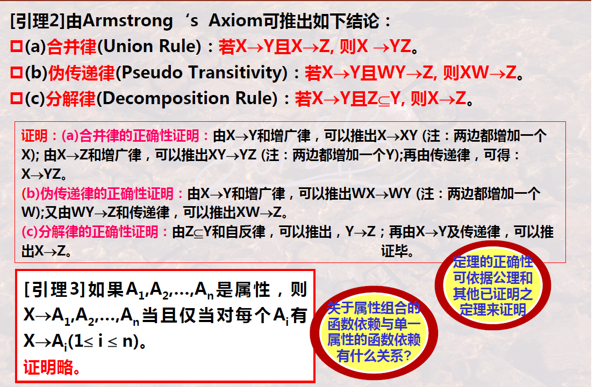
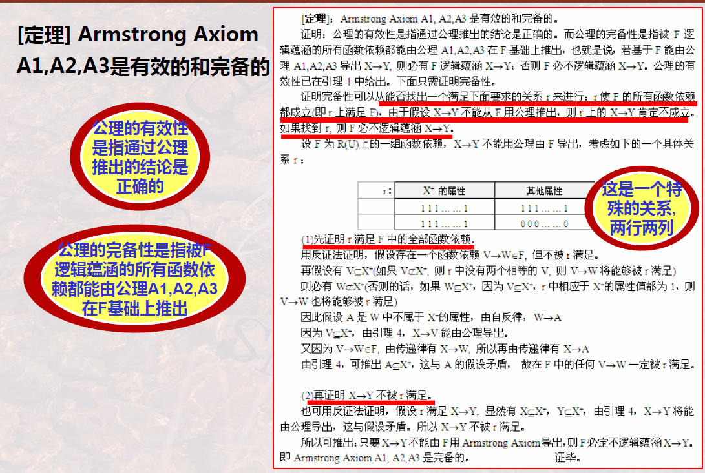

# Functional Dependency with Its Axiom and Theorem

## Functional Dependency

### 1 Definition

It’s important to find **data dependency sets**

>   Examples:
>
>   
>
>   We need some careful analysis to get all the functional dependencies

### 2 Character of functional Dependency

>   Examples:
>
>   
>
>   

There may be some constraints concerning functional dependency

### 3 Full functional Dependency and Partial functional Dependency

#### 3.1 Definition

In partial functional dependency, there are uncontrolled redundancies

>   Examples:
>
>   

### 4 Transitive functional Dependency

-   There must be “real three parts” in the transitive functional dependency
-   The conditions aim to eliminate **non-trivial** functional dependencies
-   There will be uncontrolled redundancies in transitive functional dependency

>   Examples:
>
>   

## Concepts Concerning functional Dependency

### 1 Candidate Key and Primary Key

-   Candidate Key
-   Primary Key
-   Prime Attribute
-   Alternative Attribute

>   Examples:
>
>   

### 2 Foreign Key

### 3 Logical Implications

-   The two red girds below indicate the same thing

### 4 Closure

## Axioms and Theorems

### 1 Armstrong Axiom

>   Deduce new functional dependencies by given functional dependencies

-   So when we express a relation schema later, we need to give not only **attribute set** but also **functional dependency set**
-   Notice that the argumentation rule should be XU$\rarr$YZ
-   Notice the **usage** of Armstrong Axiom

### 2 Armstrong Axiom Deduction

-   Lemma 3 indicates the relation between **single attribute functional dependency** and union attributes functional dependency
-   We can easily demonstrate lemma 3 with union rule and decomposition rule

### 3 Attribute Closure

## Cover and Minimal Cover

### 1 Definition of Cover

### 2 Calculate Attribute Closure

>   
>
>   Notice that the **left part** of a functional dependency is also **an attribute set**

>   

### 3 Property of functional Dependency Set

-   Divide the **right part** into **single attribute**

### 4 Minimal Cover

-   The third entry means that no attribute in $X$ is redundant

## Summary

