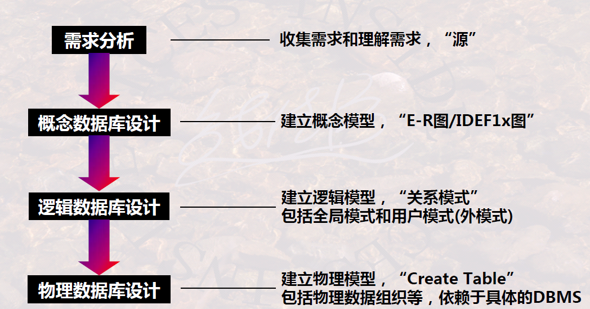
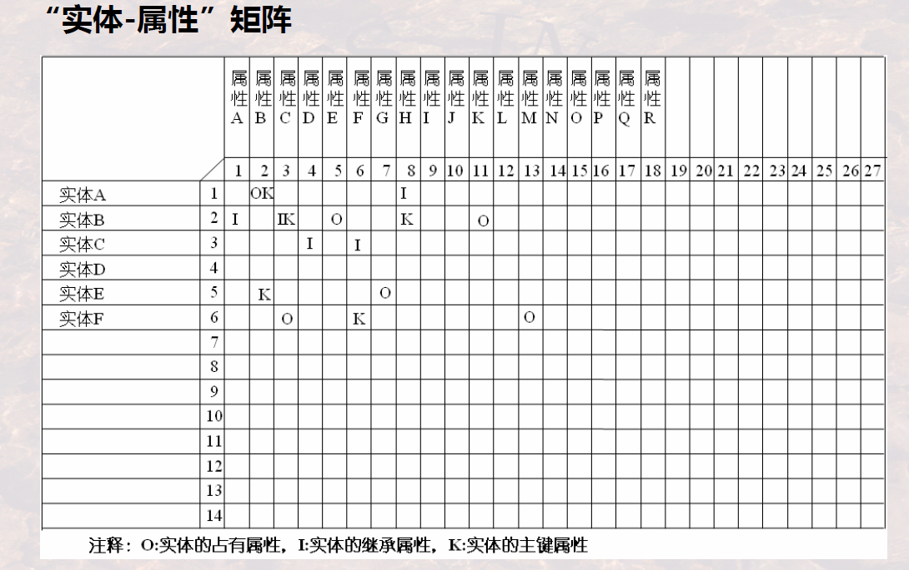

# Process of Database Design

## Overview

1.   Demand analysis
2.   Conceptual database design 
3.   Logical database design 
4.   Physical database design

## Demand Analysis

### 1 Overview

### 2 Source List and Attribute List

### 3 Brief Summary

## Conceptual Database Design

### 1 Overview

-   Discover the **nature relationship**
-   Helpful for **comprehending demand**

### 2 Two Design Thoughts of Conceptual Database

### 3 Possible Conflicts in Database Design

### 4 Outcomes

E-R Diagram / IDEF1x Diagram: 

-   Key-level Diagrams are most commonly-used

---

Entity List:

---

Entity Definition Table:

---

Entity-Relationship Matrix:

---

Entity-Attribute Matrix:

### 5 Brief Summary

