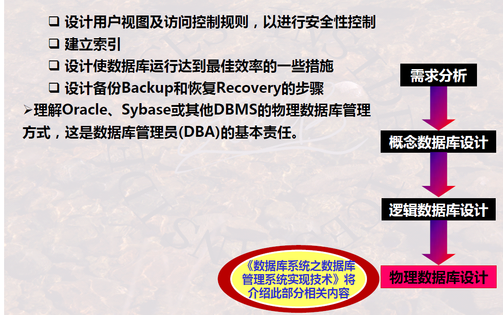

# Process of Database Design

## Overview

1.   Demand analysis
2.   Conceptual database design 
3.   Logical database design 
4.   Physical database design

## Demand Analysis

### 1 Overview

### 2 Source List and Attribute List

### 3 Brief Summary

## Conceptual Database Design

### 1 Overview

-   Discover the **nature relationship**
-   Helpful for **comprehending demand**

### 2 Two Design Thoughts of Conceptual Database

### 3 Possible Conflicts in Database Design

### 4 Outcomes

E-R Diagram / IDEF1x Diagram: 

-   Key-level Diagrams are most commonly-used

---

Entity List:

---

Entity Definition Table:

---

Entity-Relationship Matrix:

---

Entity-Attribute Matrix:

### 5 Brief Summary

## Logical Database Design

### 1 Overview

### 2 Transforming from E-R Diagram to Relation Schema

#### 2.1 Tow Ports:

---

#### 2.2 Basic Transformation:

---

#### 2.3 Composite and Multi-valued Attribute:

---

#### 2.4 Relationship:

1:1 partial or full participation

1:m

m:n

---

#### 2.5 Identifier-dependent entities:

---

#### 2.6 Specialize and Generalize:

-   Just **inherit primary key** in schema, rather than all attributes (if incomplete)

Complete or Incomplete:

---

#### 2.7 Multi-Relationship:

-   Type 1 transformation doesn’t allow partial participation
-   Type 2 transformation allows partial participation

>   

#### 2.8 IDEF1x

### 3 Problems

#### 3.1 Controlled Redundancy and Uncontrolled Redundancy:

#### 3.2 Insert and Delete Exceptions

>   

#### 3.3 How to Avoid

#### 3.4 :star:Normative Database Design

According to **Data Dependence**, judge the **Relationship Normal Form**, then apply the **Schema Decomposition**

### 4 Brief Summary

## Physical database design

### 1 Overview

Physical database design is related to **the concrete database system**

### 2 Brief Summary

## Summary

