# Problems of Schema Decomposition

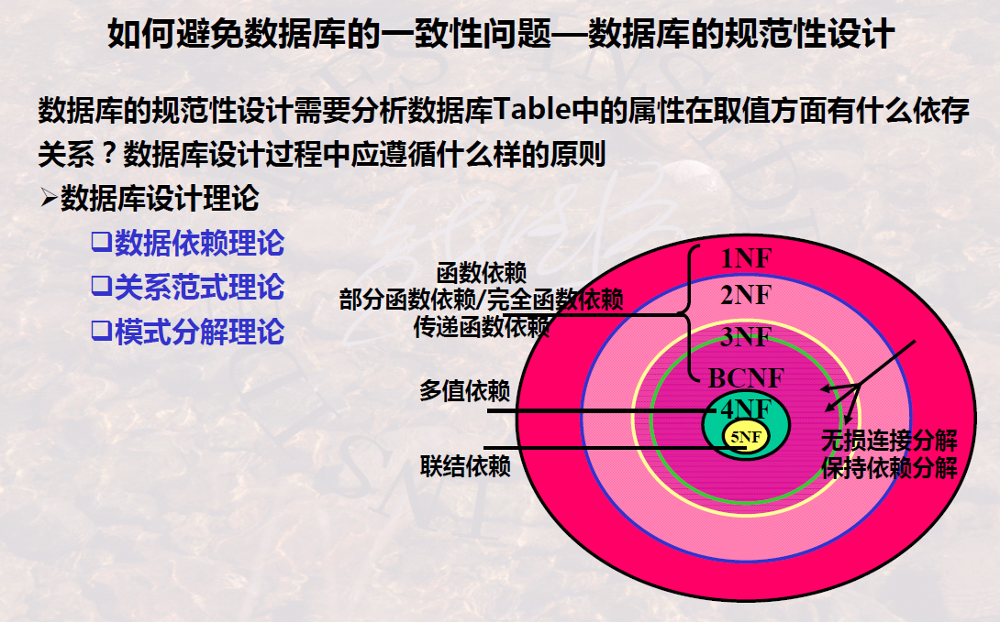

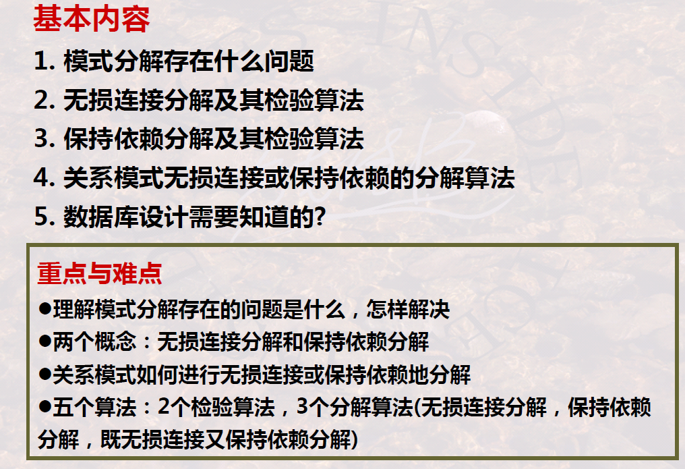

## Overview of Schema Decomposition

### 1 Definition

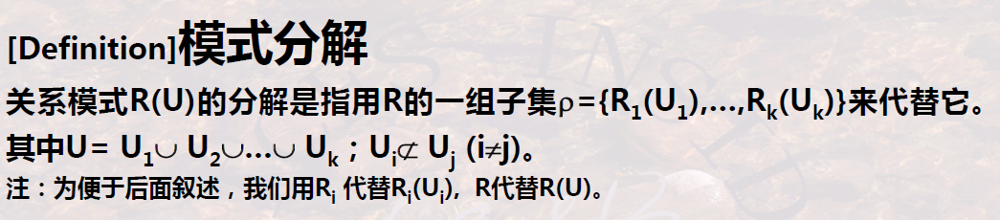

Aspects to take care of:

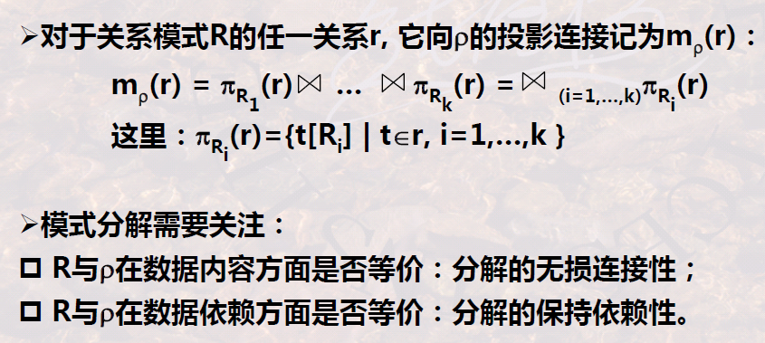

-   The “join” here is “natural join”

### 2 Equivalence of Data Content

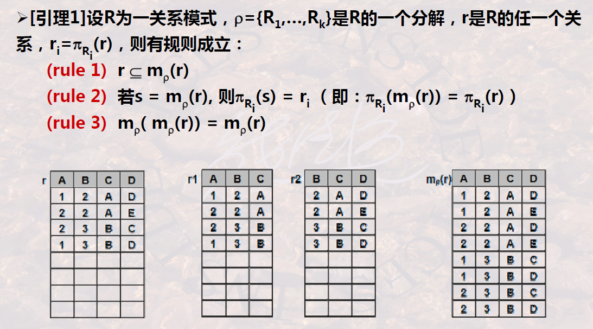

-   **Rule 1** indicates that there will be **more information** after joining, which may contain some ***wrong information***
    -   If it does contain wrong information, we call this **lossy join**
-   **Rule 2** means the result of joining after projecting causes the same results when projected again
-   **Rules 3** means that **no more information** will be produced after projecting and joining over and over again

### 3 Equivalence of Data Constraint

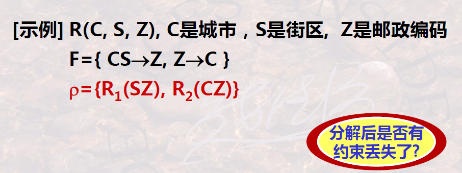

>   It does lose some constraint

### 4 Schema Decomposition

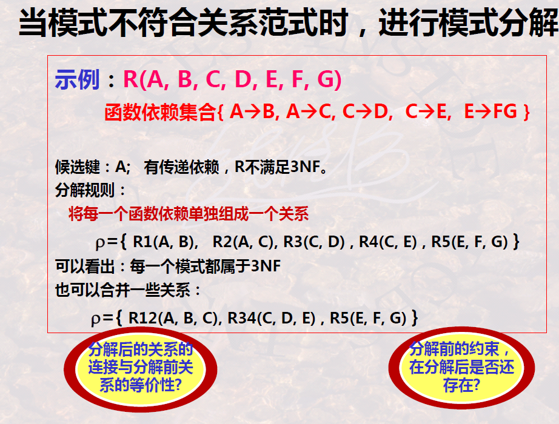

## Lossless Decomposition and Its Testing Algorithm

### 1 Definition

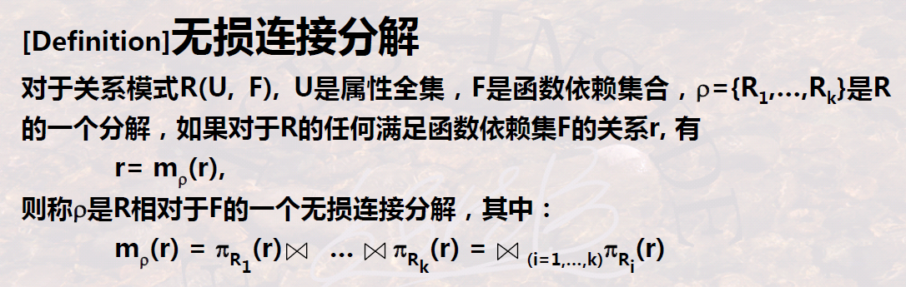

### 2 Testing Algorithm

1.   Construct an $R_\rho$ Table
2.   Modify $R_\rho$ Table according to **function dependencies**
     -   Lines having same value about X each other
     -   Let the decided Y of the same line also same, with $a_j$ or $b_{ij}$
3.   Try finding a line with all $a_j$s

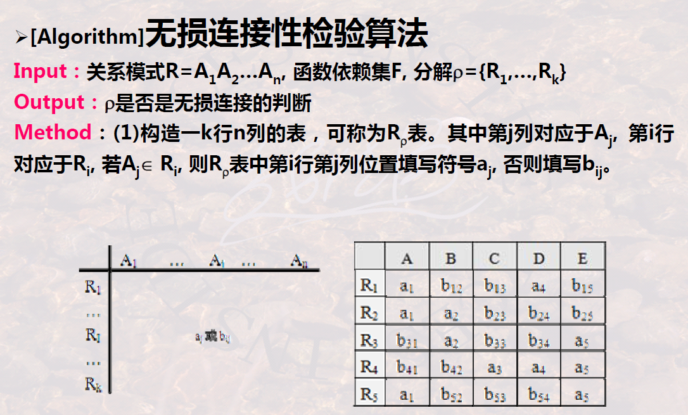

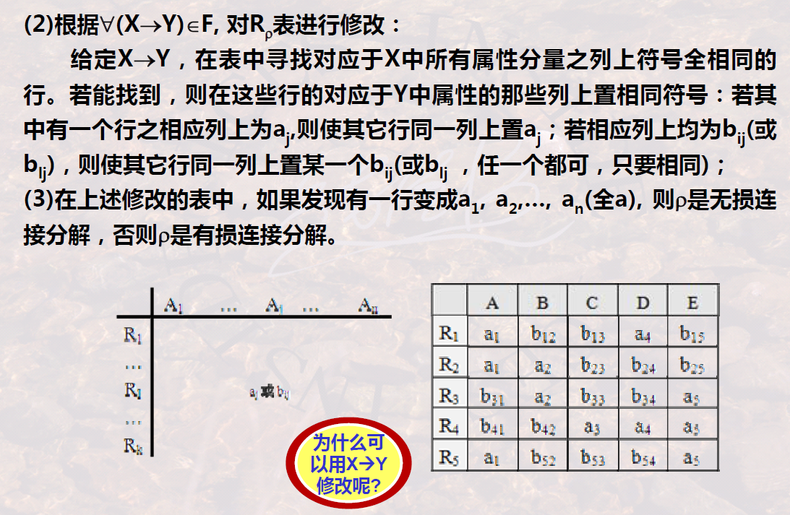

>   Example:
>
>   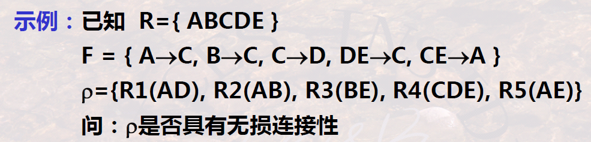
>
>   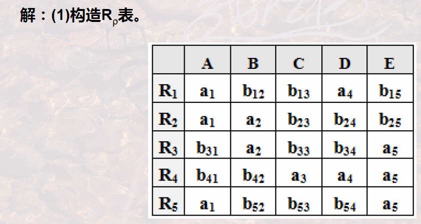
>
>   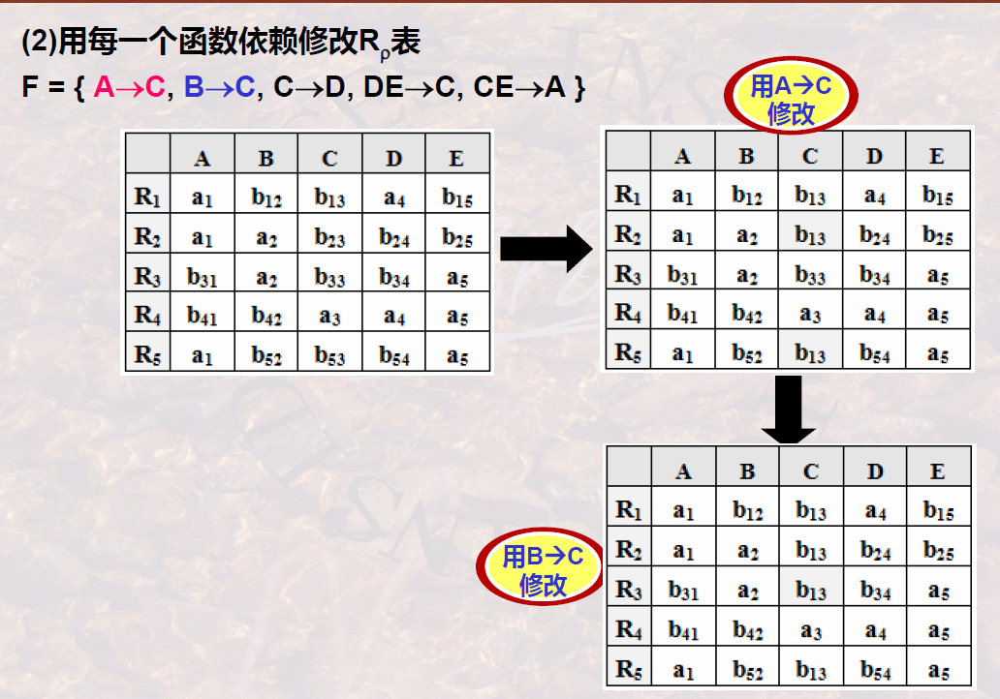
>
>   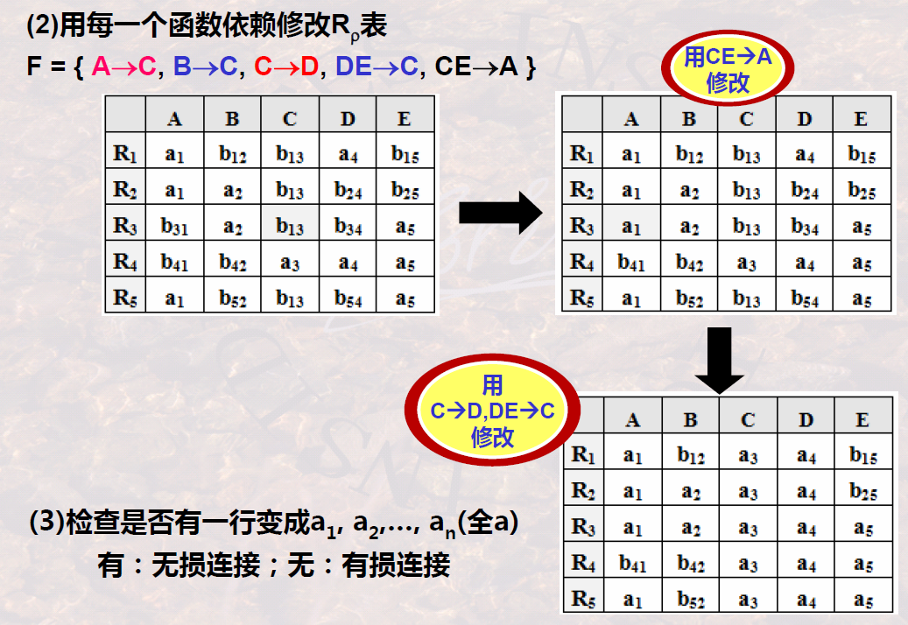

---

A simple version in **binary decomposition**:

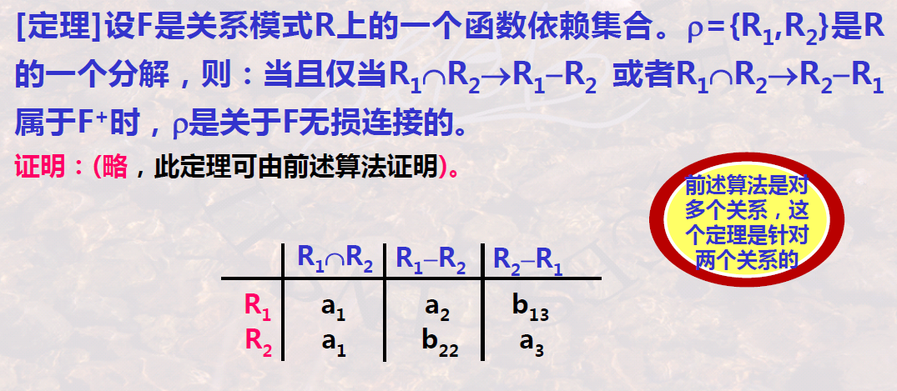

### 3 Properties of Lossless Decomposition

-   Decompose further into more subsets
-   Decompose directly more subsets

