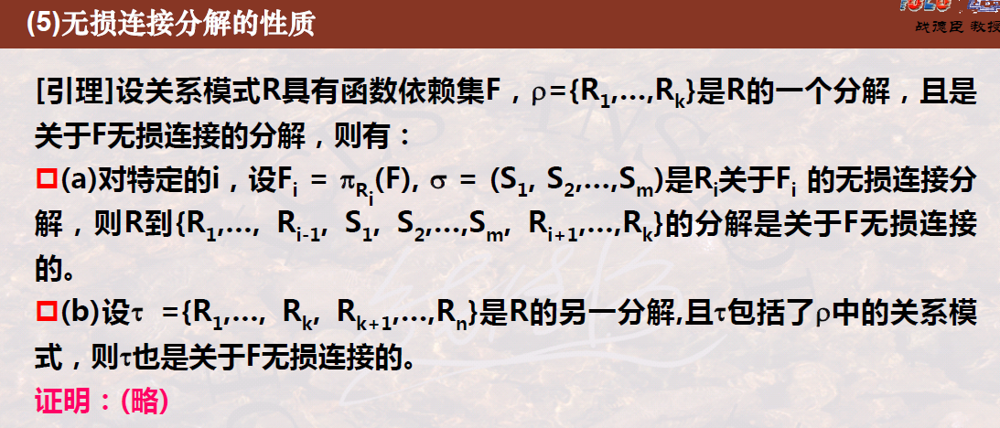
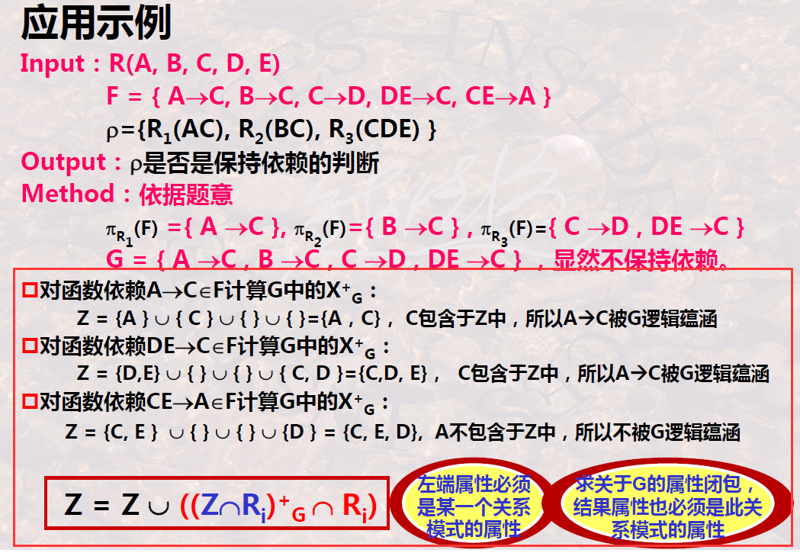
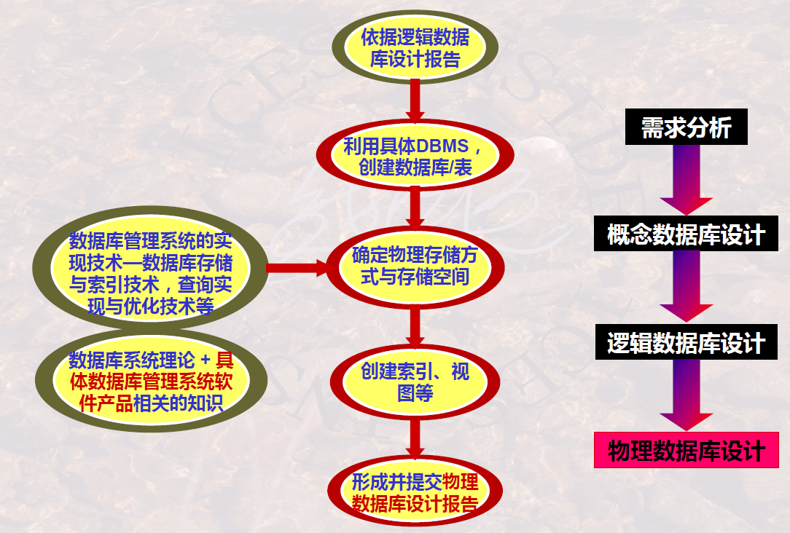

# Problems of Schema Decomposition

## Overview of Schema Decomposition

### 1 Definition

Aspects to take care of:

-   The “join” here is “natural join”

### 2 Equivalence of Data Content

-   **Rule 1** indicates that there will be **more information** after joining, which may contain some ***wrong information***
    -   If it does contain wrong information, we call this **lossy join**
-   **Rule 2** means the result of joining after projecting causes the same results when projected again
-   **Rules 3** means that **no more information** will be produced after projecting and joining over and over again

### 3 Equivalence of Data Constraint

>   It does lose some constraint

### 4 Schema Decomposition

## Lossless Join Decomposition and Its Testing Algorithm

### 1 Definition

### 2 Testing Algorithm

1.   Construct an $R_\rho$ Table
2.   Modify $R_\rho$ Table according to **function dependencies**
     -   Lines having same value about X each other
     -   Let the decided Y of the same line also same, with $a_j$ or $b_{ij}$
3.   Try finding a line with all $a_j$s

>   Example:
>
>   
>
>   
>
>   
>
>   

---

:star:A simple version in **binary decomposition**:

-   So if the two decomposed relation is **unrelated**, it must not be lossless decomposition

### 3 Properties of Lossless Decomposition

-   Decompose further into more subsets
-   Decompose directly more subsets

## Remaining Function Dependency Decomposition and Its Testing Algorithm

### 1 Definition

-   Mind the definition of $\pi_{R_i}(F)$

>   

### 2 Testing Algorithm

>   Example:
>
>   
>
>   -   So we can easily get the conclusion with human’s eyes

## Decompose Schema into 3NF or BCNF

>   
>
>   

### 1 Decompose Schema into BCNF with Lossless Join

-    
-    

### 2 Decompose Schema into 3NF Remaining Function Dependency

-    

### 3 Decompose Schema with Lossless Join and Remaining Function Dependency

-   So long as one schema contains the whole original candidate key 

### 4 Decompose Schema into 4NF with Lossless Join

-   the same thought as BCNF

## Join Dependency and Fifth Normal Form

### 1 Join Dependency

Relationship between multi-valued dependency and join dependency:

Others:

### 2 5NF

-   Remembering its conception is just OK

## Summary about Database Design

### 1 Theories about Database Design

### 2 Primary Problem about Database Design

## Brief Summary

