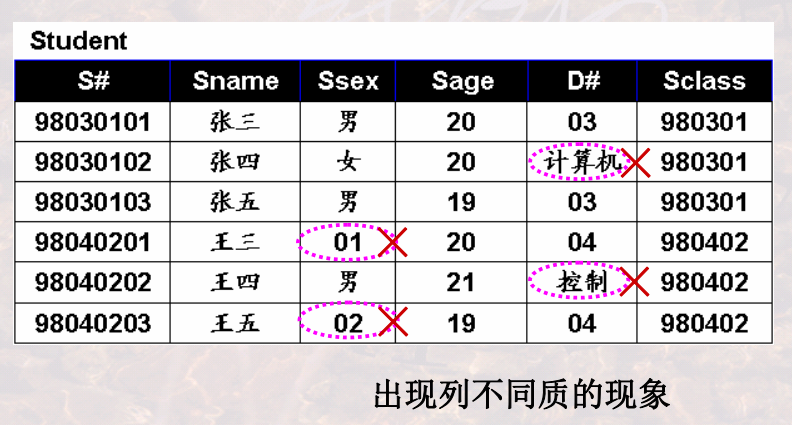

# 关系模型

## 基本概念

-   一组概念
-   三个完整性 

### 1 关系模型概述

#### 1.1 关系模型的提出

#### 1.2 关系模型的研究内容

-   描述table
-   table的操作
-   table操作的含义、结果、约束

#### 1.3 关系模型的三要素

#### 1.4 关系模型与关系数据库语言的关系

关系运算：

-   基于关系代数的运算：基于集合的运算

-   基于关系演算的运算

    -   元组演算：基于逻辑的运算

    -   域演算：基于示例的运算

        >   虽然形式上与元组演算类似，但是以域为单位的，操作的对象是域（元组演算则是元组）

数学语言转换为计算机语言：

#### 1.5 开发软件系统的一种思维

基于数学的设计与开发

#### 1.6 主要学习内容

### 2 什么是关系

#### 2.1 表的构成要素

>   

#### 2.2 表的严格定义

列的取值范围：域

元组及所有可能的组合：笛卡尔积

关系：笛卡尔积的子集

>   域名是对域的命名，属性名是对关系中列的命名

关系模式：Schema / Head，对关系的描述

>   注意这里的R(A1:D1,...)就应该叫做**关系模式**，不应当认为其是关系

>   

-   DBMS中的关系模式：`关系模式(属性名 域名, ...)`

    

-   域名就是`属性类型(长度)`

关系模式与关系：

思维回顾：

#### 2.2 关系的特性

列**同质**：

>   

不同列不同属性名：

>   

行列互换性：

-   列区分：属性名
-   行区分：某几列的值/关键字

>   

不重复：

-   这里就体现出了表和关系的区别

>   

第一范式：

>   
>
>   
>
>   让不符合的转换为符号的，加记录、加列

#### 2.3 重要概念

候选码(Candidate Key)/候选键：

-   注意其**极小性**

>   
>
>   **多个候选码**：
>
>   

主码(Primary Key)/主键：

>   

主属性与非主属性：

>   

>   

外码(Foreign Key)/外键：

-   两个关系通常是靠外码连接起来的

>   
>
>   

#### 2.5 小结

### 3 关系模型中的完整性约束

>   回顾三要素：
>
>   -   数据结构：关系
>   -   基本操作：并、差、积、选择、投影
>   -   完整性约束

#### 3.1 实体完整性

>   

空值的概念：

-   ？：

-   ？的影响：

    >   

-    

    -   常用的策略：**默认值**

#### 3.2 参照完整性

>   
>
>   

#### 3.3 用户自定义完整性

-   在**列数据类型**基础上的约束
-   对属性或属性组合的约束

>   

#### 3.4 DBMS对关系完整性的支持

### 4 总结

## 关系代数

-   一个集合，操作，一个集合，关系代数，结果

### 1 关系代数概述

#### 1.1 关系代数运算的特点

#### 1.2 关系代数运算的基本操作

#### 1.3 为什么要提出关系代数

借鉴思想，先实现基本操作，再组合成复杂操作

### 2 关系代数的基本操作

#### 2.0 关系代数运算的约束

>   

>   满足并相容性的例子：
>
>   

#### 2.1 “并”操作

-   注意：需要去重
-   当然前提是并相容
-   位置无关性

>   抽象举例：
>
>   
>
>   语义举例：
>
>   
>
>   
>
>   注意如何正确表述汉语的查询要求

#### 2.2 “差”操作

-   注意，不满足交换律

    

>   抽象举例：
>
>   
>
>   语义举例：
>
>   
>
>   
>
>   注意如何正确表述汉语的查询要求

