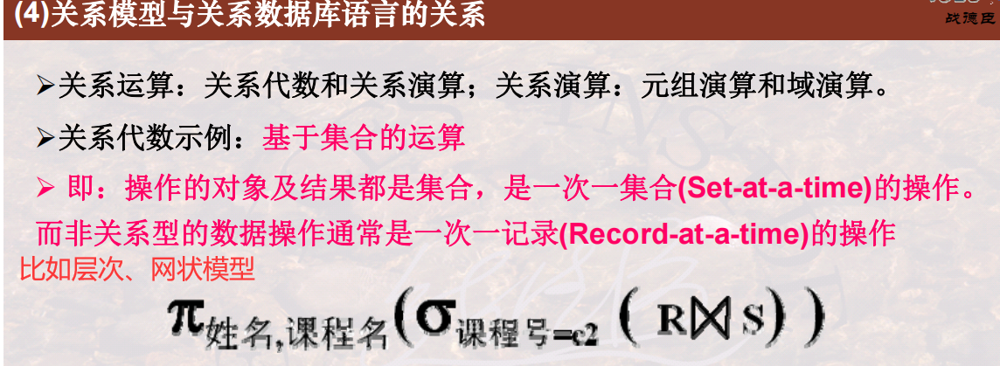
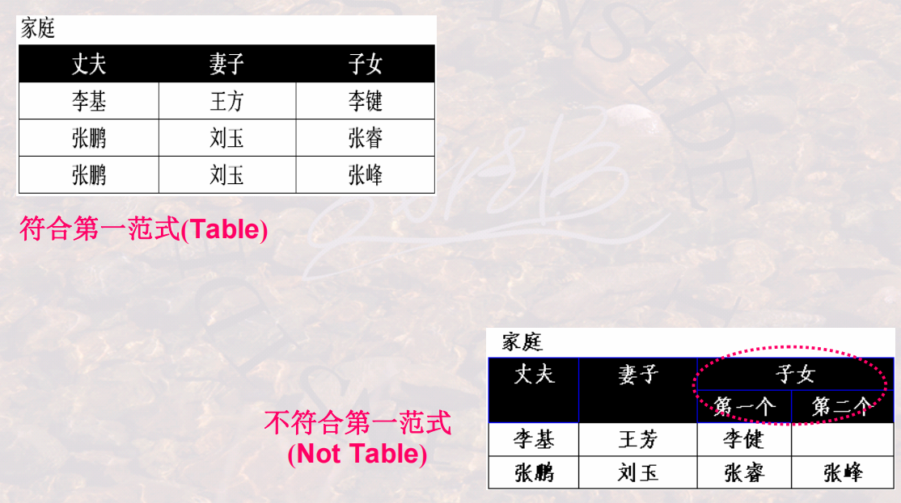
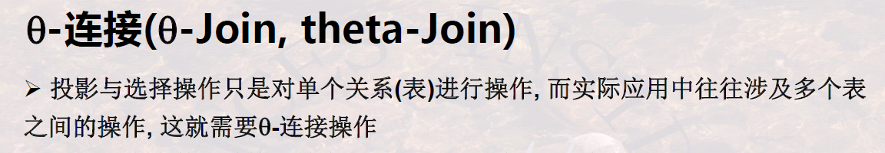
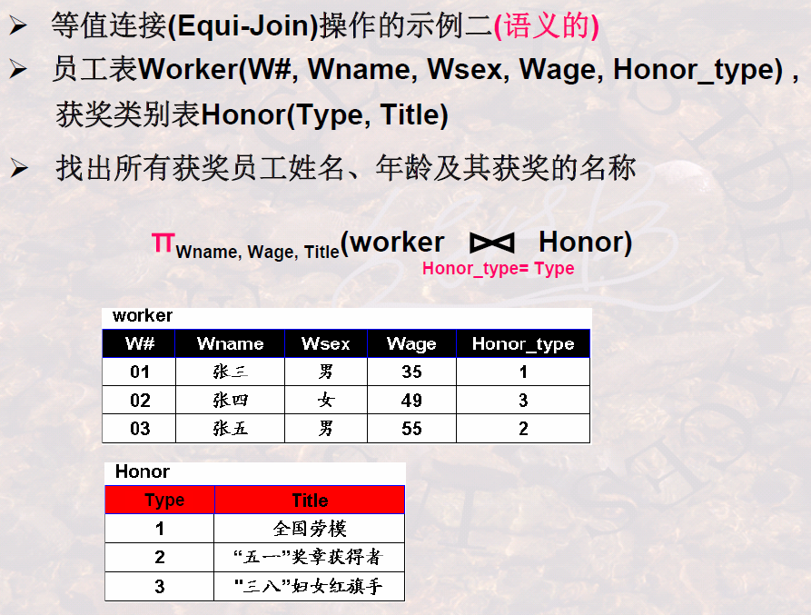
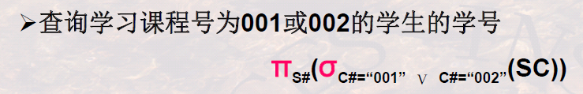
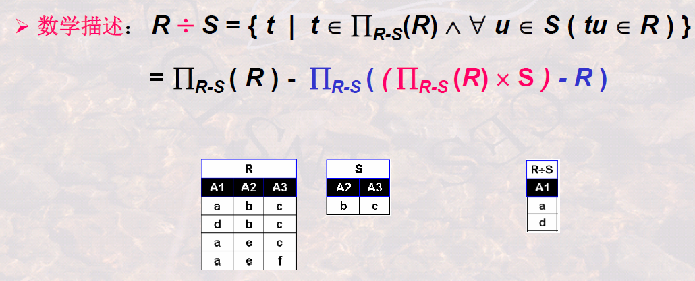
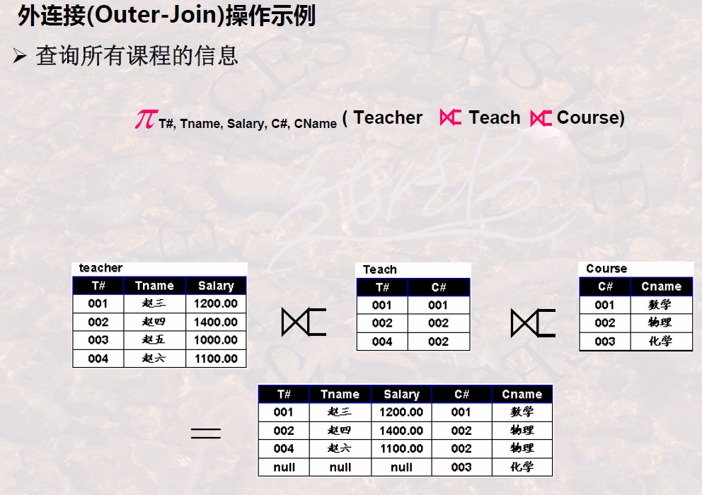

# 关系模型

## 基本概念

-   一组概念
-   三个完整性 

### 1 关系模型概述

#### 1.1 关系模型的提出

#### 1.2 关系模型的研究内容

-   描述table
-   table的操作
-   table操作的含义、结果、约束

#### 1.3 关系模型的三要素

#### 1.4 关系模型与关系数据库语言的关系

关系运算：

-   基于关系代数的运算：基于集合的运算

-   基于关系演算的运算

    -   元组演算：基于逻辑的运算

    -   域演算：基于示例的运算

        >   虽然形式上与元组演算类似，但是以域为单位的，操作的对象是域（元组演算则是元组）

数学语言转换为计算机语言：

#### 1.5 开发软件系统的一种思维

基于数学的设计与开发

#### 1.6 主要学习内容

### 2 什么是关系

#### 2.1 表的构成要素

>   

#### 2.2 表的严格定义

列的取值范围：域

元组及所有可能的组合：笛卡尔积

关系：笛卡尔积的子集

>   域名是对域的命名，属性名是对关系中列的命名

关系模式：Schema / Head，对关系的描述

>   注意这里的R(A1:D1,...)就应该叫做**关系模式**，不应当认为其是关系

>   

-   DBMS中的关系模式：`关系模式(属性名 域名, ...)`

    

-   域名就是`属性类型(长度)`

关系模式与关系：

思维回顾：

#### 2.2 关系的特性

列**同质**：

>   

不同列不同属性名：

>   

行列互换性：

-   列区分：属性名
-   行区分：某几列的值/关键字

>   

不重复：

-   这里就体现出了表和关系的区别

>   

第一范式：

>   
>
>   
>
>   让不符合的转换为符号的，加记录、加列

#### 2.3 重要概念

候选码(Candidate Key)/候选键：

-   注意其**极小性**

>   
>
>   **多个候选码**：
>
>   

主码(Primary Key)/主键：

>   

主属性与非主属性：

>   

>   

外码(Foreign Key)/外键：

-   两个关系通常是靠外码连接起来的

>   
>
>   

#### 2.5 小结

### 3 关系模型中的完整性约束

>   回顾三要素：
>
>   -   数据结构：关系
>   -   基本操作：并、差、积、选择、投影
>   -   完整性约束

#### 3.1 实体完整性

>   

空值的概念：

-   ？：

-   ？的影响：

    >   

-    

    -   常用的策略：**默认值**

#### 3.2 参照完整性

>   
>
>   

#### 3.3 用户自定义完整性

-   在**列数据类型**基础上的约束
-   对属性或属性组合的约束

>   

#### 3.4 DBMS对关系完整性的支持

### 4 总结

## 关系代数

-   一个集合，操作，一个集合，关系代数，结果

### 1 关系代数概述

#### 1.1 关系代数运算的特点

#### 1.2 关系代数运算的基本操作

#### 1.3 为什么要提出关系代数

借鉴思想，先实现基本操作，再组合成复杂操作

### 2 关系代数的基本操作

#### 2.0 关系代数运算的约束

>   

>   满足并相容性的例子：
>
>   

#### 2.1 “并”操作

-   注意：需要去重
-   当然前提是并相容
-   位置无关性

>   抽象举例：
>
>   
>
>   语义举例：
>
>   
>
>   
>
>   注意如何正确表述汉语的查询要求

#### 2.2 “差”操作

-   注意，不满足交换律

    

>   抽象举例：
>
>   
>
>   语义举例：
>
>   
>
>   
>
>   注意如何正确表述汉语的查询要求（汉语的这部分也写进总结博客里吧）

#### 2.3 广义笛卡尔积

- 交换律

  

- 度数：相加

  

- 基数：相乘

  

- 一个检索涉及到多个表时，需要将这些表串接或拼接起来，然后才能检索，这时，就要使用广义笛卡尔积运算

- 

> 抽象举例：
>
> 
>
> 
>
> 语义举例：
>
> 

#### 2.4 “选择”操作

- 选择操作从给定的关系中选出满足条件的行
- 组成条件的三要素：分量、逻辑运算符、比较表达式
- 条件的书写很重要，尤其是当不同运算符在一起时，要注意运算符的优先次序，优先次序自高至低为${ 括弧；\theta ；\neg ；\and ；\or }$

> 抽象举例：
>
> 
>
> 语义举例：
>
> 
>
> - 这里加**引号**表示**字符串**
>
> > 战神教我们的书写顺序：先写`(R)`，代表要操作`R`这个关系，再写$\sigma$，代表要进行选择操作，然后再写`con(t)`，代表选择的条件
>
> 
>
> 

#### 2.5 “投影”操作

- 用户可以根据需要通过投影、选择操作查询他所关心的数据信息。

- 对于**关系**来说，如果投影后有**重复元组**，应该去掉

> 抽象举例：
>
> 
>
> 语义举例：
>
> 
>
> 投影与选择操作一起使用的语义举例：
>
> 

#### 2.6 小结/书写思路

操作含义

用户语义

### 3 关系代数的扩展操作

> 用基本操作组合实现的操作

#### 3.1 “交”操作

性质：

- 

> 

> 抽象举例：
>
> 
>
> 语义举例：
>
> 
>
> 
>
> 

#### 3.2 “$\theta-$连接操作”

- 现实中有很多**对多个关系的操作**
- 也有许多需要**关系与自身连接**的操作

> 

数学定义：

> 

:star:DBMS的实现：

- 也就是说，从实现的角度来讲，**$\theta-$连接**操作快于**笛卡尔积再选择**

  > 所以，能连接就连接，会比较快，能**优化**

> 抽象举例：
>
> 
>
> 语义举例：
>
> 
>
> 
>
> > 注意，这只理论操作的过程，实际实现时不需要这样笛卡尔积，能直接得到结果
>
> :star:关系自连接与**更名**：:star:
>
> > 这个例子很重要，体会**<u>连接、选择、投影</u>**的结合作用
>
> 
>
> 
>
> > 有的教学中会将**更名**也作为**基本操作**

#### 3.3 “等值-连接”操作

> 一种特殊的$\theta-$连接

> 
>
> 注意这里说的第二点，就是**效率问题**

> 抽象举例：
>
> 
>
> 语义举例：
>
> 
>
> 
>
> 注意，这只理论操作的过程，实际实现时不需要这样笛卡尔积，能直接得到结果

#### 3.4 “自然连接”操作

> 普遍使用的一种$\theta-$连接

> 就是要有**属性名相同的属性**，可以有多个。然后结果中还会自动去掉同样的属性

> 抽象举例：
>
> 
>
> 语义举例：
>
> 
>
> > 理论步骤：
> >
> > 
> >
> > 
>
> 

#### 3.5 小结/书写思路

- **连接操作**是数据库的重要特点，效率高

### 4 组合与应用训练

#### 4.1 集合操作思维训练

1. 涉及几个表

   > 涉及几个表本质是看需要**哪些列**，同时还要看语义情景下**表之间的关系**，无关的不必要的表不算在内

2. 要求啥条件

3. 关注哪些列

---

举例1：

> 由里向外书写

---

举例2：连接条件

#### 4.2 语法和语义问题

举例：正确的

---

举例：语义“且”错误的

> 这个用交运算实现也可以
>
> 

---

举例：“语义且”改正的

---

举例：错误使用“自然连接”

> 自然连接会**将值相等的属性连接完后直接合并成一个**，自己自然连接自己得到的还是自己

---

举例：语义“不相等”，错误的

---

举例：语义“不相等”，不满足**并相容性**，错误的

---

举例：语义“不相等”，正确的

> 解决方法：先投影好再差

#### 4.3 基本思路

### 5 复杂扩展操作

#### 5.1 “除”操作

概述：

---

前提运算：

---

定义：

- 属性的构成

  

- 元组的构成

  

---

数学描述：

> 第一条数学描述就是按照上面的**构成**说的；
>
> 第二条数学描述要通过例子理解

---

抽象举例：

抽象举例：用基本操作表示除法

- 先找出组合完之后不在R中的，再做差，剩下的就是在R中的

> 1. 把R对应的属性扔掉，剩下的去重（投影）
> 2. 因为要找的就是剩下的当中，和S组合后是R中记录的东西，所以先把剩下的这个东西直接和S乘积一下，得出一大堆
> 3. 一大堆中有些在R中有些不在R中，差R，就得到了不在R中的，也就是说这些组合是不行的，组完了不在R中
> 4. 把上一步差完的东西再删除对应的属性，就是这些东西不能和S组合，所以最后把它们差去就可以

语义举例：主要应用在带有“全部”、“所有”字样的语义中

- **“全部”主要是全在了S上**，因为得到“商”，和S所有的记录组合“全部”都是R中的

语义举例3：体会“中间表”的作用

> 
>
> 在这里是一样的，因为S#和C#是主键，如果不是主键呢？？？

#### 5.2 “外连接”操作

概述：外连接的提出

- 有的老师没讲课我也想知道，也要体现在结果里

---

定义：

- 连接时的依据还是**同名属性的值相等**

举例：

---

外连接的分类：

举例：

### 6 总结

回顾计算机系统的设计思想之一：基本运算的组合

- 有关系代数操作，数据库管理系统的实现就会变容易了

