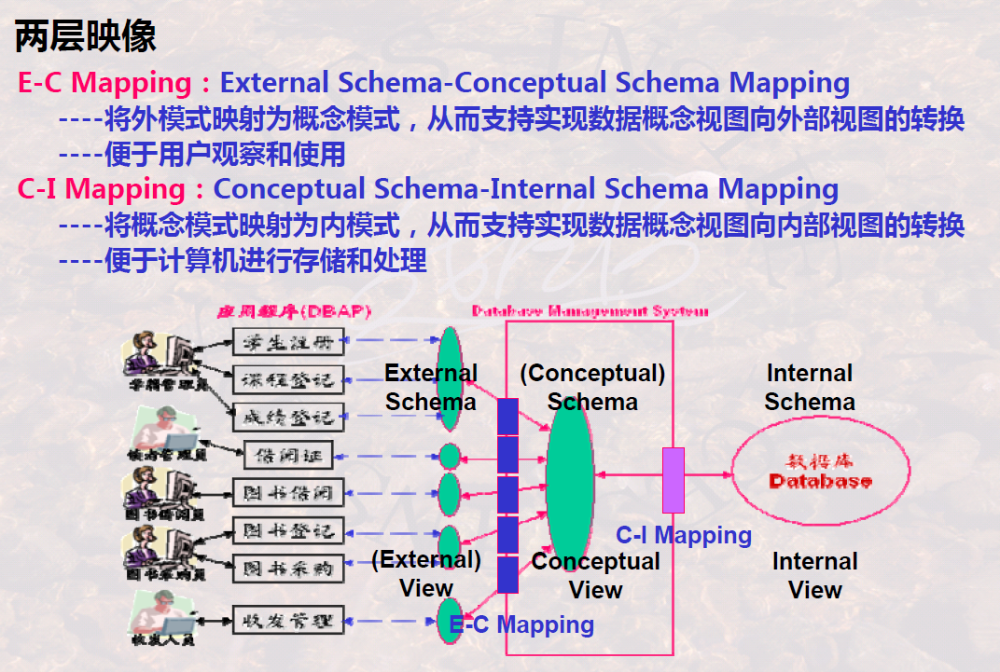
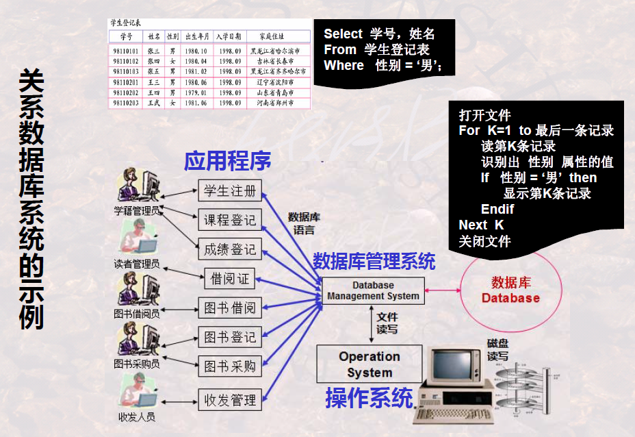
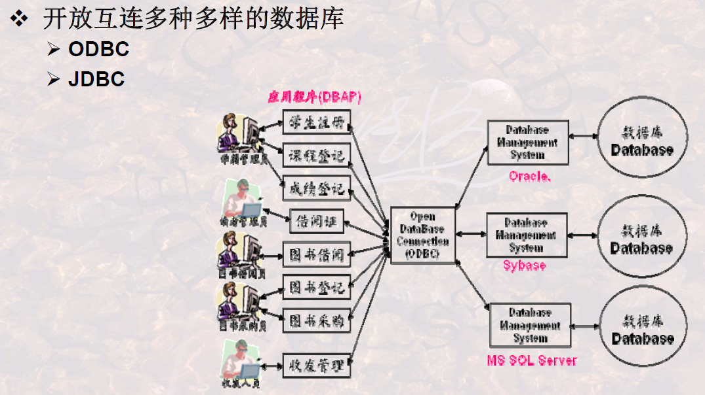

# 数据库系统的结构抽象与演变

> 

## 数据库系统的标准结构

### 1 数据库系统的分层抽象

> 

工作环境：

三层：

- 外部层次/用户层次：局部
- 概念层次/逻辑层次：全局
- 内部层次/物理层次：存储

### 2 数据(视图)与模式

数据的内容与数据的结构

模式：抽象

视图：具体、实例

### 3 三级模式两层映像

三级模式：

（局部）外部/用户/局部/外/子模式——外部/用户视图：数据的结构描述——数据

（全局、本质）概念/逻辑模式——概念/逻辑视图：数据的结构描述与关联关系——数据

（概念）内部/物理模式——内部/物理视图：存储数据的结构描述——数据

> 概念/逻辑/全局模式简称为**模式**，外部/用户视图简称为**视图**

两级映像：

映像：一种结构映射为另一种结构

- 外模式映射为概念模式——全局视图转换为**视图**
- 概念模式映射为内模式——全局视图转换为**内部视图**

由用户定义三级模式，由DBMS程序自动实现两层映像

用户应用程序开发：

- HL：高级语言
- DSL：数据子语言

### 4 两个独立性

> 
>
> 为啥非要给用户一个局部的视图去开发，为啥非要抽象出一个概念层？
>
> 因为要尽可能保证外模式不变，避免应用程序不断修改。其实就是**接口**

逻辑数据独立性：用接口指导应用程序的开发，允许EC映像的变化，但屏蔽概念模式的变化，

物理数据独立性：用接口指导内部存储的设计，允许CI映像的变化，但屏蔽内模式的变化

## 数据模型

> 

### 1 数据模型的概念

> 数据模型就是**数据的结构的结构**

举例：**关系模型**

### 2 三大经典数据模型

关系模型举例：

层次模型举例：

- 实体型

  > 记录的型

- 系型

  > 联系的型，由指针确定

记录、记录之间的联系

> 记录的含义可以由模式表示

网状模型举例：

- 指针的建立很重要

## 数据库系统的演变与发展

### 1 简要发展史

> 标准化数据库系统结构模型就是三级模式两层映像

### 2 从文件系统到数据库

> 重点理解，为什么会这样发展

文件系统：

> 操作系统管理数据的特点

文件系统的特点：数据与程序的耦合度较高

数据库系统的示例：

数据库系统的特点：数据与程序解耦合

### 3 由层次模型数据库、网状模型数据库到关系数据库

层次模型与网状模型数据库：

- 需要用户建立指针

关系数据库：

- 消除了网状、层次模型的指针

DBMS在关系数据库中的重要作用：

### 4 由关系数据库到对象关系数据库、面向对象数据库

关系数据库的特点：

- 关系第一范式的要求有时对用户不方便

**对象**-关系数据库的特点：

- 支持**复合属性、多值属性**，可以不满足第一范式

  > 关系数据库是不支持这样的

- 行对象、列对象

- 结构对象（复合属性）、聚集对象（多值属性）

面向对象数据库：

XML数据库：数据交换

- 关系模型与XML的转换会在之后讲XML数据库是讲解

### 5 由多种多样的数据库到多数据库开放式互连

OBDC作为接口，规范应用程序的书写，解开应用程序与数据库管理系统的耦合

### 6 由普通数据库到与各种先进技术结合所形成的新型数据库

---

总结：

​    

