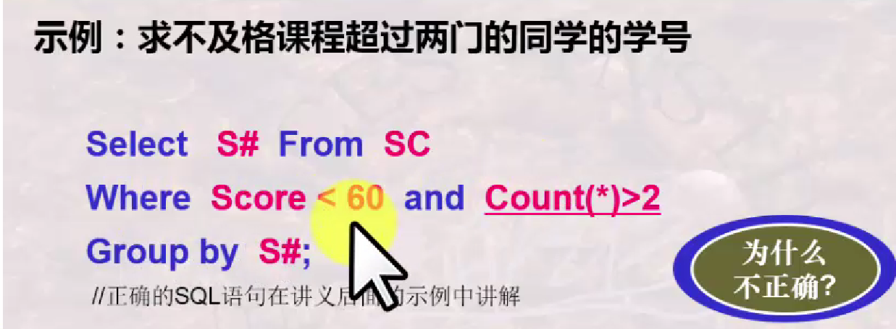
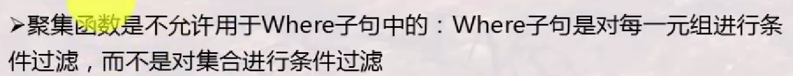
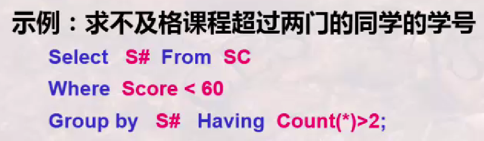
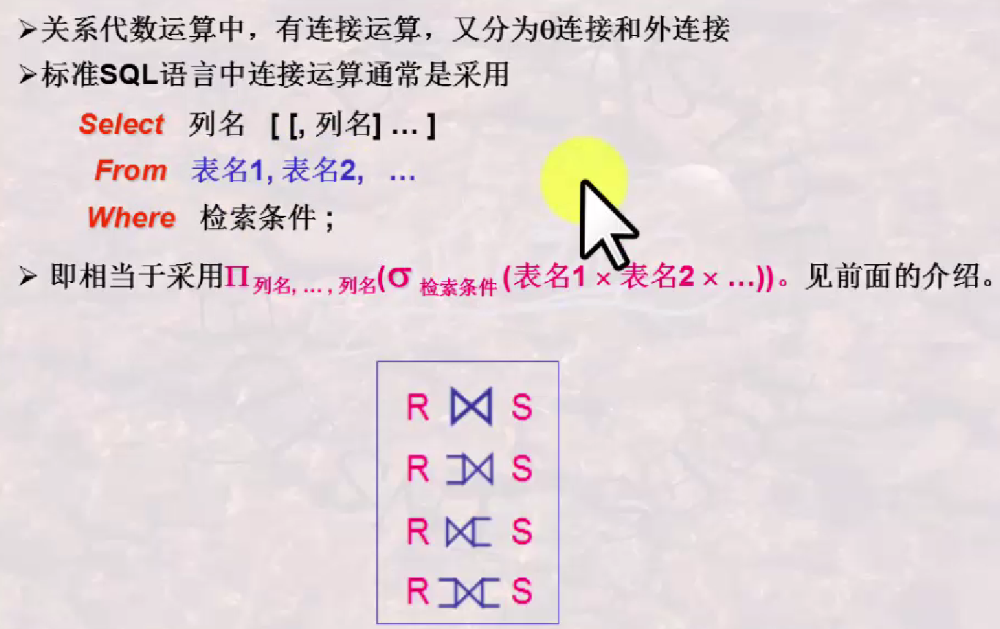
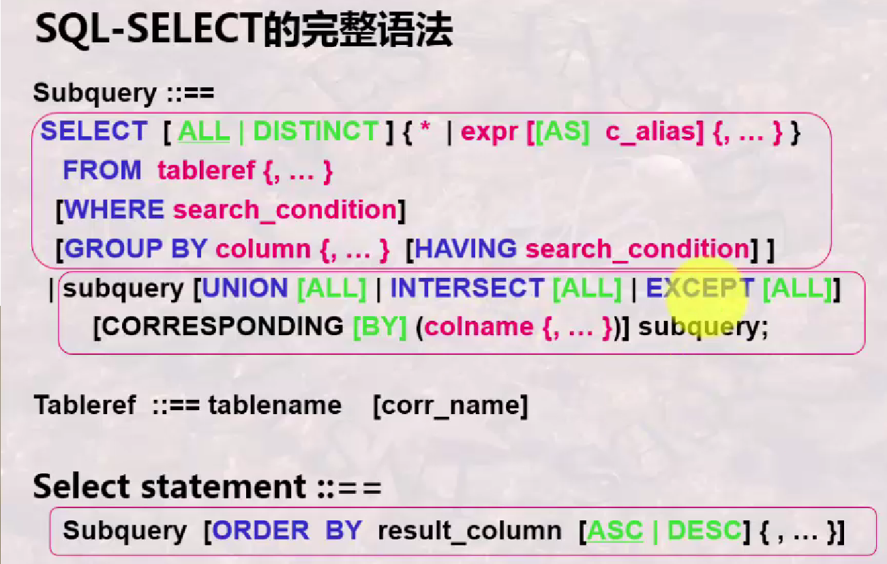

# 复杂SQL与视图

>   主要内容概览：
>
>    
>
>   重点与难点：
>
>    
>
>   -   三组谓词的运用
>   -   聚集函数、分组
>   -   视图

## 子查询

### 子查询概述

### 1 为什么需要子查询/子查询的作用

 

### 2 子查询的概念与分类

 

-   子查询返回的是**结果的集合**

## (NOT)IN谓词子查询

### 1 基本语法

 

-   表达式是某个**计算的结果**
-   注意表达式与子查询的匹配性
-   本质上等于多个`or`

>   举例：
>
>   -   枚举给出集合
>
>        
>
>   -   子查询代替**表连接**
>
>        
>
>        
>
>   -   not in/子查询结合表连接
>
>        
>
>       >   回顾之前讲过的不正确的子查询：
>       >
>       >    

### 2 子查询的相关性

-   还会有变量作用域的约束，外层无法看到内层，内层可以看到外层

>   举例：
>
>    

---

---

>   举例：
>
>   
>
>   -   Select语句本质是一个循环，循环遍历所有表记录
>
>   -   这里的子查询要用到外层查询的变量，所以从SQL实现与执行的角度讲，就不能先执行子查询得到结果集合了，而是要在每次执行外层查询时，确定外层给到内层的参数，然后再执行子查询，再判断
>
>       >   在这里，每次传递给子查询的参数就是S#，当然子查询返回的集合中往往就一个学号或者是空，但毕竟是个集合，所以还是要用`in`
>
>       >   所以说，能非相关最好还是非相关，因为子查询不用执行那么多次

## $\theta$ Some与$\theta$ All谓词子查询

### 1 基本语法

 

-   某一个/存在量词
-   所有/全称量词

>   举例：
>
>   -   “最”
>
>        
>
>        
>
>        
>
>   -   “不是最”
>
>        
>
>   -   **相关子查询**，要循环运行子查询，因为要传递参数
>
>        
>
>       >   通过这个例子也可以知道，要不要相关子查询，主要看子查询是否需要从外层查询中获取某些信息
>
>        
>
>       >   注意这里把”张三“的约束都写到外层了，而且先于子查询，这样当”张三“约束不满足时也就没必要去执行子查询了，减少子查询执行次数

>   补充：为什么不用$\theta$ Any？
>
>   
>
>   >    

### 2 等价变换

 

-   `in`和`some`是等价的

>   举例：
>
>    

---

 

-   `not in`和`<> all`是等价的

>   举例：
>
>   

## (NOT)EXISTS子查询

### 1 基本语法

 

-    
-    
    -   所有、全部$\Lrarr$**==不存在没有==**
-   ==**否定之否定**==

>   举例：相关子查询
>
>    
>
>   -   在内循环中，代表这个同学是否学过这个课，然后这个子查询的结果直接影响了`where`，从而能决定是否过滤
>
>   -   其实在没有`not`的情况下，`exist`完全没必要
>
>       

>   举例：”所有“=”不存在没“
>
>   

### 2 子查询的思路

   1.   确定最主要的投影、关系、选择条件

        -   投影（`select`）：学生姓名
        
            >    -   关系（`from`）：Student
            >       -   选择条件（`where`）：学过001号教师的所有课程

2.   选择条件中有“所有”，则逆向思维，使用`not exists`，变成“不存在没学过的课”，则在`not exists`内部，只需要查找这个学生没学过的001号教师的课
        -   投影：保留整条**课程记录**即可，投影不是重点，但要注意查找的主体是**课程**
        -   关系：Course
        -   选择条件：首先要是001号老师教的课（`C.T#=001`），并且外层的学生没学过001号教师的这个课
   3.   选择条件中的“没学过这个课”，也就是对应的记录不存在，就是查出来是空，所以再用一次`not exists`，只需要查询这个学生学过的001号教师的课
        -   投影：保留整条**课程记录**即可，投影不是重点，但要注意查找的主体是**课程**
        -   关系：SC
        -   选择条件：是外层学生的且是001号老师教的（`Student.S#=SC.S# and Course.C#=SC.C#`）
   
>   举例：”没有任何“
>
>   
>
>   -   没学过，意思就是，把这个同学当参数传入子查询，然后查一查老师讲的并且这个同学学了的记录
>   -   所以要自然连接，然后把学生条件（`S#=Student.S#`）和老师条件（`Tname=‘李明’`）加入
>
>   举例：”所有“
>
>   
>
>   -   和上上个例子相同的思路
>
>   举例：“不存在有一种xxx没xxx”
>
>   

### 3 用关系代数表达

除法：

## 结果计算与聚集计算

### 1 结果计算

>   举例：
>
>   

### 2 聚集函数

>   举例：
>
>   

## 分组查询与分组过滤

>   

### 1 分组查询语法

>   举例：
>
>   

>   举例：
>
>   错误示范：`where`中使用聚集函数
>
>   
>
>   聚集函数的操作对象是一个组，使用`where`过滤时还没有形成组

### 2 分组过滤语法

>   举例：
>
>   解决上面的错误示范，**`where`子句不能出现聚集计算**
>
>   
>
>   

### 3 where与having

>   举例：
>
>   **`where`筛选对分组的影响**
>
>   
>
>   ==需要用子查询解决==
>
>   

## SQL实现关系代数

### 1 并交差

`all`的处理：

>   包运算，可以用重复元素

>   举例：
>
>   `union`与`or`
>
>   -    
>   -    
>
>   `intersect`与`and`
>
>    
>
>   >   这时用`intersect`就可以简洁一些
>
>   `except`与`not in not exists`
>
>   
>
>   

>   

### 2 空值的处理

>   
>
>   空值的问题：
>
>   -   如何判断是空
>   -   如何参与计算

#### 2.1 空值检测

>   

#### 2.2 空值的运算处理

>   

### 3 内外连接

>   
>
>   只使用`from`就是笛卡尔积
>
>   可以对`from`进行扩展

#### 3.1 连接的语义

#### 3.2 连接条件

-   一般

-   自然

    -   全部
    -   部分

    >   注意这里没有特殊说等值

>   举例：
>
>   
>
>   

## 小结1

### 1 SQL-SELECT完整语法

### 2 SQL-SELECT继续扩展

## 视图

### 1 概念与结构

-   SQL中的视图：外视图+E-C映像
-   SQL中的基本表：概念模式

---

-   视图数据不需要重复存储，只需要存储E-C映像
-   视图的查询没问题，至于更新操作，则要看具体情况 

### 2 定义与查询

>   举例：
>
>   

>   

如何执行对视图的查询

-   最终要转换成对基本表的查询操作，合并查询语句与视图创建语句

>   在后面DBMS的实现技术中会具体介绍

>   

### 3 更新

>   

主键限制更新：

>   这个例子加入主键就可以了

---

-   分组、聚集、算术
-   唯一
-   主键

>   

### 4 撤销

>   

>   

## 小结2

