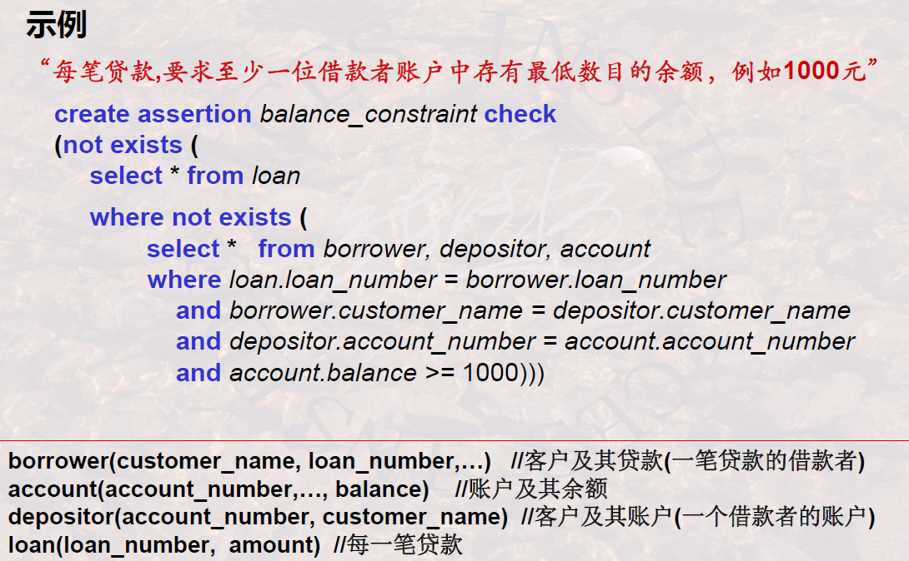
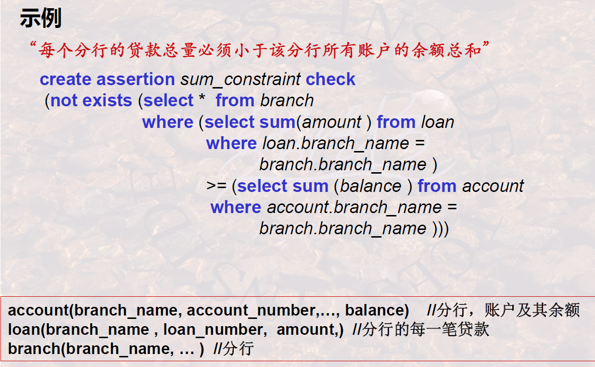

# SQL语言与数据库完整性和安全性

## 数据库完整性的概念及分类

### 1 什么是数据库完整性

 

-    

    >   数据库设计中还会讲解该部分内容，从现实生活中发现约束、表达约束，在DBMS中起作用

### 2 为什么会产生完整性问题

 

-    重点：DBMS自动防止，让DBMS承担风险

>   

### 3 怎样保证数据库完整性

 

-   方面二：**完整性控制程序**
-   方面一：**完整性规则**通常由DBA定义（DDL）

---

完整性约束规则：

 

-   四元组
-   对O在A条件下触发后，检查P，若不满足则R

### 4 数据库完整性的分类

#### 4.1 按约束对象分类

 

-   一列
-   多列/表

>    

#### 4.2 按约束来源分类

 

>    

#### 4.3 按约束状态分类

 

>   

## SQL语言之列约束与表约束—静态约束

### 1 SQL支持的约束/静态约束模型

 

 

-   所以静态约束可以只在定义时表达O和P

### 2 SQL实现约束-Create Table

 

-   列约束空格隔开，表约束用逗号隔开

---

#### 2.1 列约束

 

-   一般来说`not null`算是一种比较独立的约束
-   `search_cond`比较特别，就是P，在更新时会检查是否满足
-   `references`是外键，那个`colname`，如果和正在定义约束的这个字段名字相同，就可以省略
    -   `on delete`是级联删除，是指在删除外键来源表时，对引用外键的表的操作
        -   `cascade`是删除
        -   `set null`是置空
    -   外键当然也有`on update`，这里没讲

>   举例：
>
>    

#### 2.2 表约束

 

-   还是那些约束类型（除了`not null`），只是作用在多列上

    -   这里在`refrences`前要写`foreign key`表明是哪些列联合外键了

-   表约束与列约束、表约束之间是用`,`隔开的

    >   一个列的列约束用空格，列本身之间也用`,`

>   举例：
>
>    
>
>    
>
>   复杂的`check`
>
>    

#### 2.3 Alter Table

 

>   举例：
>
>    
>
>   

### 3 SQL实现约束-Assertion

断言的概念与定义：

 

-   断言定义多了会影响数据库运行效率，增加DBMS的负担

 

>   举例：
>
>    
>
>   

## SQL语言之触发器—动态约束

### 1 模型

-   都需要定义，某些情况下可以省略

### 2 Trigger

-   过程完整性

---

定义：

-   `reference`用于定义后面会使用的变量
    -   其实就是在起别名，不超别名后面也能用，就直接用`new`、`old`也行
-   `for each row`是检索结果的每一行都要应用
-   `for each statement`是对每条SQL语句应用
-   `begin atomic ... end`是定义多条原子语句，就是这些语句要么全部执行，要么都别执行

---

事件：

---

别名：

---

举例1：

 

-   O：`salary on teacher`
-   P：`x.salary < y.salary`
-   A：`before update`
-   R：`raise_application_error`

举例2：

 

举例3：

 

-   外键相关修改，其实外键约束本身也可以自带

举例4：

 

举例5：

 

举例6：

 

>   小结1：
>
>   

## 数据库安全性的概念及分类

### 1 数据库安全性的概念

 

-   本课程只介绍DBMS方面的安全性

### 2 数据库安全性的分类

 

 

### 3 数据库管理员的责任和义务

## 数据库自主安全性机制

### 1 数据库自主安全性

 

### 2 DBMS怎样实现数据库自主安全性

### 3 数据库自主安全性访问规则

-   用户S对对象O，在满足P条件时，拥有权利t 

---

举例：

### 4 自主安全性的实现方式

#### 4.1 存储矩阵

-   只有SOt，P可能太复杂，就省略了

>   

#### 4.2 视图

-   视图可以通过`where`反映谓词
-   结合存储矩阵使用

## SQL语言之安全性实现

### 1 SQL语言的用户与权利

### 2 SQL-DCL的命令及其应用

语法：

-    
-   授权+视图可以完全较为完整的自主安全性

  

>   举例：
>
>    
>
>    

## 安全性控制的其他方面

### 1 自主安全性的授权过程及其问题

 

 

-   广度与深度范围限制

 

-   收回问题

>   这些问题本课程不讲

### 2 强制安全性

>   还记得最开始的安全性分类吗，有自主安全性和强制安全性

-   高级别用户不能写低级别数据，因为一旦写了，低级别数据中就会出现高级别用户相关的信息，这样是不合法的，可能低级别的用户就不再能访问了

---

 

-   对列安全性的规定
-   对行安全性的规定

---

新的问题：

 

-   多级关系，有更多的管理技巧

    >   本课程不讲

>   小结2：
>
>   