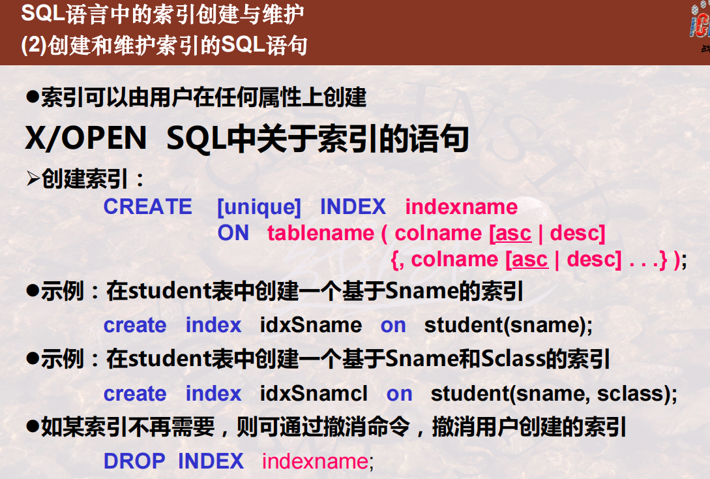

# Index

## What and Why Index

### 1 Concept of Index

In life:

Ordered little scale data

---

In DB:

-   Secondary storage structure
-   Based on: Table
-   Function: Quickly search record
-   Constituted: **Index Entries** in *Index File*
    -   Index-field: **different** value in table field
    -   Pointer

### 2 Ordinary Features of Index File

-   Existence
-   Organization
-   Multiple
-   Little
-   Synchronize

### 3 Evaluation of Index

### 4 Distinguish Concepts About Index

-   Notice that the three keys below may not **unique**

## Index Creation and Maintaining

### 1 Basic Knowledge

-   Primary index
-   DBMS maintain and delete all the indexes automatically

### 2 SQL Creating & Maintaining Index

-   It follows X/OPEN standard
-   `unique` is optional. If set, filed value should be no repeating
-   Combination is permitted

### 3 Regard Performance of Index

-   Balance **performance optimization** and **cost**
-   **Type** of index

## Dense Index & Sparse Index

### 1 Conceptual Framework

-   Every index value
-   All
-   Partial

### 2 Allocating Record by Sparse Index

-   Biggest less than
-   Ordered
-   Lighter but slower
-   Primary index: one index entry per block

>   Value excluded in index file may be included in main file

### 3 Allocating Record by Dense Index

>   Value excluded  in index file must be excluded in main file

#### 3.1 On candidate key

-   One-to-one correspondence
-   May be not ordered

#### 3.2 On non-candidate key

*Unique index field in index file:*

-   One-to-many
-   Ordered

---

*Non-Unique index field in index file:*

-   “one-to-one”
-   Not ordered

---

*Unique index field in index file:*

-   “one-to-many”
-   Middle layer
-   Ordered

---

*Features summary:*

-   Index field in index file is **unique or not**
-   Index field in main file is **ordered or not**

## Primary Index & Secondary Index

### 1 Primary Index

-   Anchor record
-   Primary key

### 2 Secondary Index

-   Every different value
-   Bucket / Middle Layer
-   Effective

### 3 Primary vs. Secondary

-   Block address
-   Record address

Primary Index almost define the organization of primary file, thus can be used to reorganize primary file. But secondary index not.

## Other Types of Index

 

