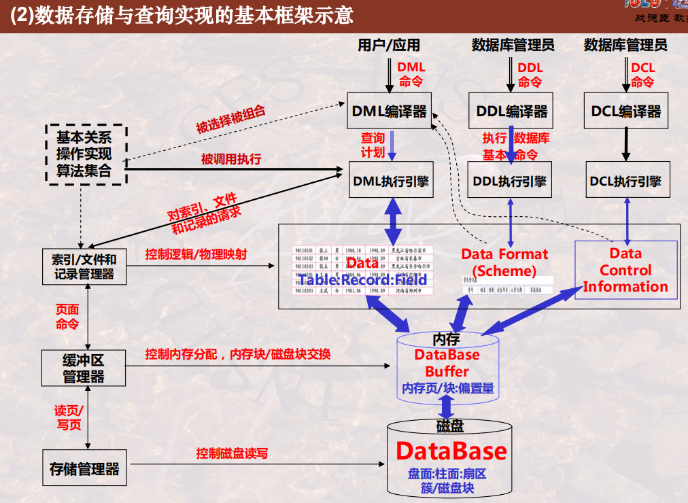

# Physical Storage

## Storage Architecture of Computer System

### 1 Storage and Search About Database

-   Index
-   Query Algorithm

### 2 Storage Architecture

-   Goals: **high speed, huge volume**
-   How to implement? **Storage architecture**
-   Three types of database in a broad sense
    -   But we always regard main memory as **database buffer**

### 3 Access Time Difference between Storage Levels

### 4 OS Managing Disk and Data

-   OS manage data by **FILE**
-   R/W disk by **BLOCK**

### 5 OS Managing Memory and Buffer

-   R/W memory by **PAGE** 

## Structure and Features of Disk

### 1 Disk and its Volume

>   Refer to Operation System

### 2 R/W Disk

>   Refer to *Operation System*

-   Key to optimize: I/O count
-   How to decrease disk r/w time?

### 3 Raise Speed and Reliability of Disk

-   **Parallel**
    -   Divide:
        -   **Bit**
        -   **Block**
-   **Reliable**
    -   Verify
        -   Between **blocks**
        -   Between **disks**

According to tech above, we have **RAIDs** below:

-   RAID0
-   RAID1
-   RAID2
-   RAID3
-   RAID4
-   RAID5

>   Refer to *Composition Principle of Computer*

## Basic Thoughts of DBMS Storage and Query

### 1 Map of Data Storage

Three maps:

-   Map from record to block
-   Map from page to block
-   Map from record to page

Three managements:

-   Disk: manage itself
-   Memory: manage itself and call disk interface
-   File / Index (Logic): manage itself call memory and disk interface

And then we can implement query algorithm

### 2 Components of DBMS / Framework

>   Functions of DBMS

Four levels:

-   Storage: disk block
-   Buffer: memory page
-   Record / Index: table & schema & data control information
    -   table: DML
    -   schema: DDL
    -   data control information: DCL
-   Application: DML & DDL & DCL
    -   Engine and Compiler
    -   Algorithm

